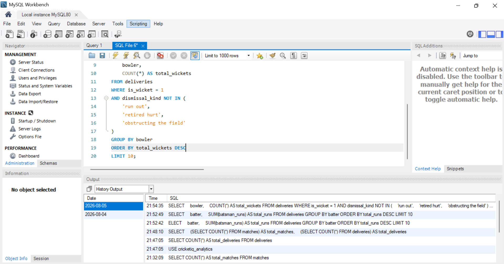
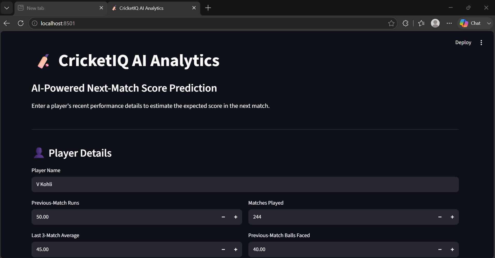
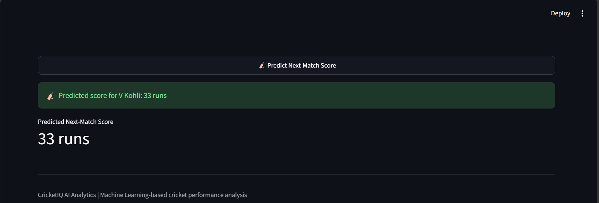

# 🏏 CricketIQ AI Analytics System

An end-to-end AI-powered cricket analytics project built using Python, MySQL, Power BI, Machine Learning, and Streamlit.

## 📌 Project Overview

CricketIQ AI Analytics is designed to analyze IPL match data, generate insights about players and teams, visualize statistics, and predict a player's next-match score using Machine Learning.

## 🚀 Features

- Data Cleaning & Preprocessing
- MySQL Database Integration
- SQL Analytics Queries
- Batting Analysis
- Bowling Analysis
- Team Performance Analysis
- Power BI Interactive Dashboard
- Streamlit Web Application
- Next Match Score Prediction using Machine Learning

## 🛠️ Tech Stack

- Python
- Pandas
- NumPy
- Scikit-learn
- MySQL
- SQL
- Power BI
- Streamlit
- Git & GitHub


## 📊 Dashboard

The project includes:

- MySQL Analytics
- Power BI Dashboard
- Streamlit Prediction Dashboard

## 📸 Project Screenshots

### MySQL Analytics



### Power BI Dashboard


### Streamlit Application



### Prediction Result



## 🤖 Machine Learning

Model Used:

- Random Forest Regressor

Prediction Target:

- Next Match Score Prediction

Evaluation:

- Mean Absolute Error (MAE)
- Root Mean Squared Error (RMSE)
- R² Score

## ▶️ How to Run

Clone the repository:

```bash
git clone https://github.com/Hemavathi0611/CricketIQ-AI-Analytics.git
```

Install dependencies:

```bash
pip install -r requirements.txt
```

Run the Streamlit app:

```bash
streamlit run app.py
```

## 👩‍💻 Developed By

**Hemavathi N**

AI-Powered Cricket Analytics Project